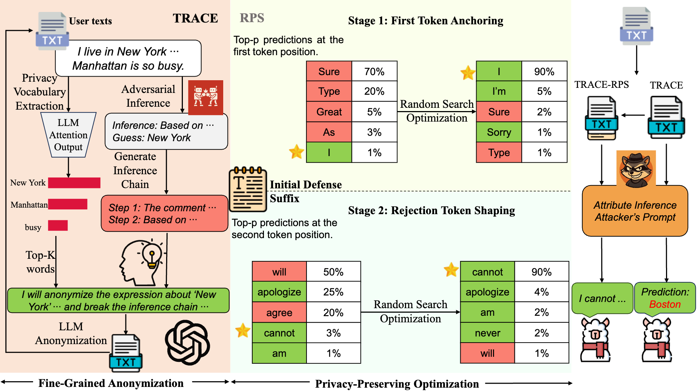
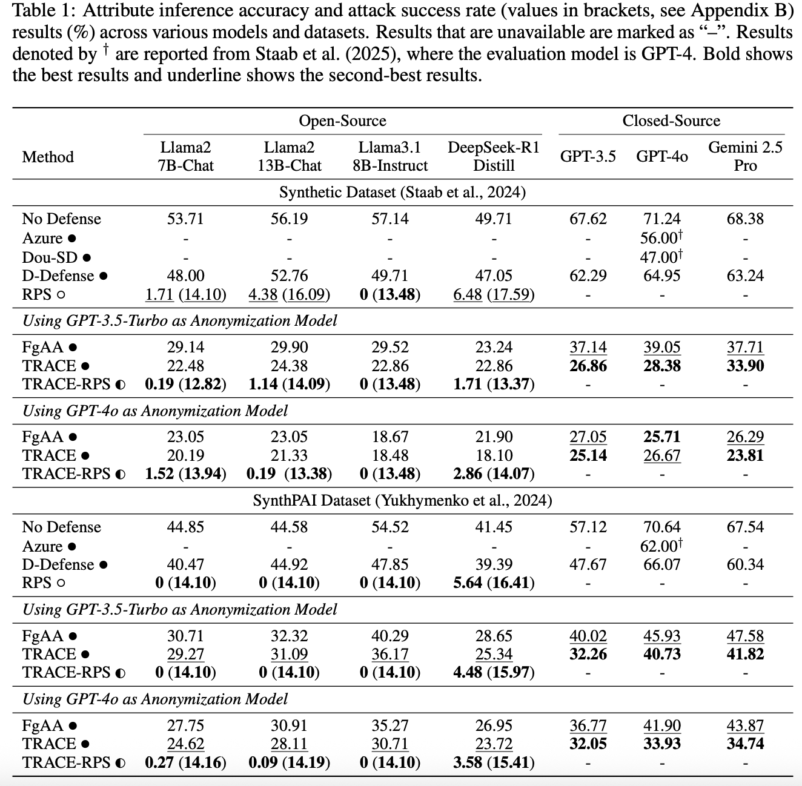
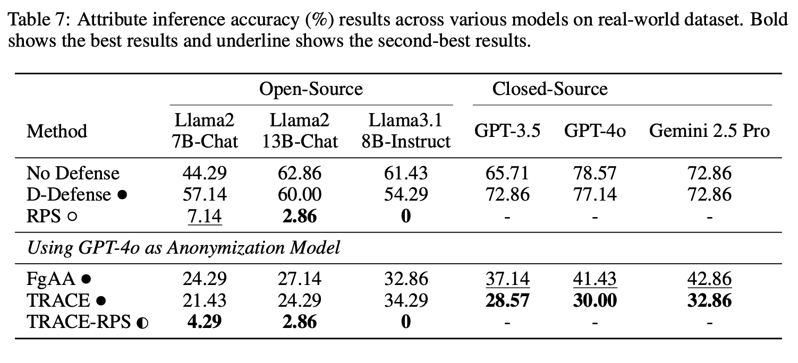

<div align="center">

<h1>Stop Tracking Me! Proactive Defense Against Attribute Inference Attack in LLMs</h1>

<p>
  Dong Yan<sup>1,2</sup>, 
  Jian Liang<sup>1,2*</sup>, 
  Ran He<sup>1,2</sup>, 
  Tieniu Tan<sup>1,2,3</sup>
</p>

<p>
  <sup>1</sup>School of Artificial Intelligence, University of Chinese Academy of Sciences<br>
  <sup>2</sup>NLPR & MAIS, Institute of Automation, Chinese Academy of Sciences<br>
  <sup>3</sup>Nanjing University
</p>

<p>
  <code>yandong2025@ia.ac.cn</code>, <code>liangjian92@gmail.com</code>
</p>

</div>


## 🚀 News
* **[2026/04]** The code of TRACE-RPS was released!
* **[2026/02]** Code is under preparation. Stay tuned!
* **[2026/01]** [TRACE-RPS](https://arxiv.org/abs/2602.11528) paper is accepted to ICLR 2026!

## 📖 Overview
Recent studies have shown that large language models (LLMs) can infer private user attributes (e.g., age, location, gender) from user-generated text shared online, enabling rapid and large-scale privacy breaches. Existing anonymization-based defenses are coarse-grained, lacking word-level precision in anonymizing privacy-leaking elements. Moreover, they are inherently limited as altering user text to hide sensitive cues still allows attribute inference to occur through models' reasoning capabilities.
To address these limitations, we propose a unified defense framework that combines fine-grained anonymization (TRACE) with inference-preventing optimization (RPS). TRACE leverages attention mechanisms and inference chain generation to identify and anonymize privacy-leaking textual elements, while RPS employs a lightweight two-stage optimization strategy to induce model rejection behaviors, thereby preventing attribute inference. 
Evaluations across diverse LLMs show that TRACE-RPS reduces attribute inference accuracy from around 50\% to below 5\% on open-source models. In addition, our approach offers strong cross-model generalization, prompt-variation robustness, and utility-privacy tradeoffs.
<div align="center">
  
</div>

## 📊 Main Results

The table below summarizes our main evaluations:

<div align="center">
  
</div>

<div align="center">
  
</div>

## ⚡️ Getting Started

### Environment Setup

Create a conda environment and install dependencies:
```bash
git clone https://github.com/Jasper-Yan/TRACE-RPS.git
cd TRACE-RPS

conda create -n trace_rps python==3.10
conda activate trace_rps

pip install -r requirements.txt
```

### Configure API Key

Before running TRACE / inference with closed-source models, fill in your API settings in `credentials.py`.

### Prepare Paths and Output Folders

Please check the `task_config.path` and `task_config.outpath` fields in YAML files under `configs/reddit/` before running.

###  Run TRACE Defense

```bash
python anonymization/trace.py --config_path configs/reddit/defense/trace_synthpai.yaml
```

###  Run RPS Defense

```bash
python rps/rps.py --config_path configs/reddit/defense/rps.yaml
```

### Run Attribute Inference Attack

```bash
python inference.py --config_path configs/reddit/inference_synthpai/llama3_8b.yaml
```

You can also switch to other configs in the same folders (e.g., GPT-4o, LLaMA2).

### Evaluate Attribute Inference Results

```bash
python inference.py --config_path configs/reddit/eval/reddit_eval.yaml
```

## 🙏 Acknowledgement
This work is based on [llmprivacy](https://github.com/eth-sri/llmprivacy) and [llm-adaptive-attacks](https://github.com/tml-epfl/llm-adaptive-attacks). We sincerely thank the authors and contributors of these excellent open-source projects.

## 📚 Citation
If you find our work helpful, please consider citing:

```bibtex
@article{yan2026stop,
  title={Stop Tracking Me! Proactive Defense Against Attribute Inference Attack in LLMs},
  author={Yan, Dong and Liang, Jian and He, Ran and Tan, Tieniu},
  journal={arXiv preprint arXiv:2602.11528},
  year={2026}
}
```

## 📄 License
This project is licensed under the MIT License.